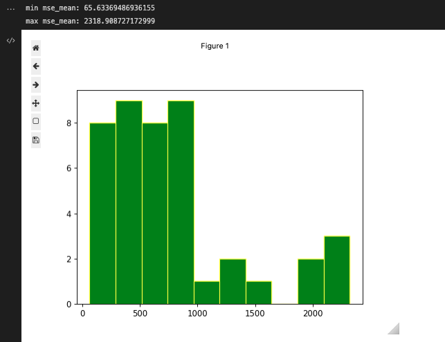
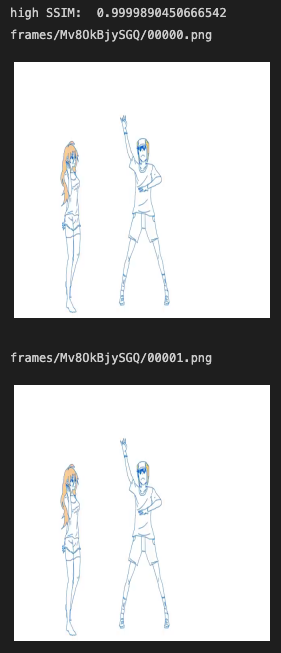
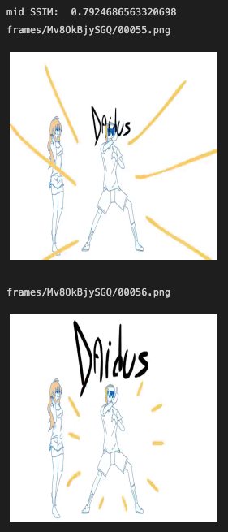
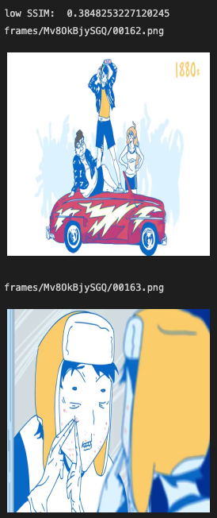
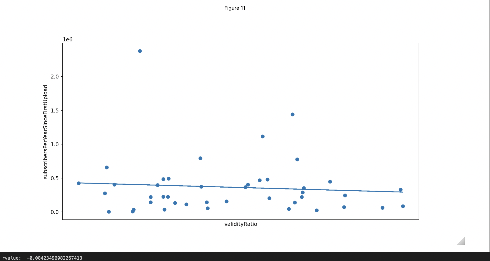
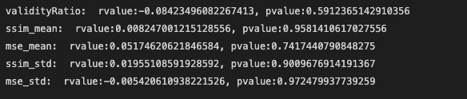
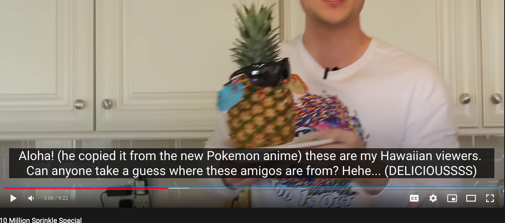
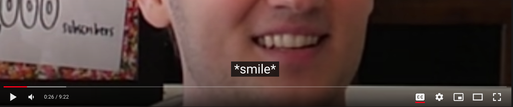
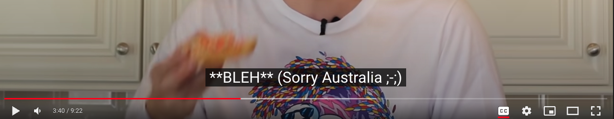
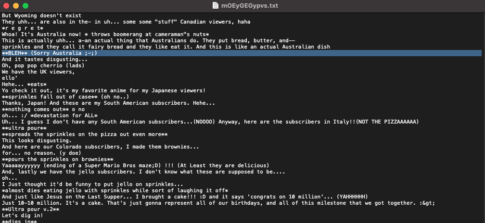

## Semantic and Visual Analysis of 2D commentary/ storytime Youtubers
***
# Introduction
I've subscribed to 35 channels on Youtube and 12 of them are hand-drawn animation commentary youtubers.
By 'animation commentary youtuber', I mean people who make animations of what they're narrating. To see an example, copy a videoId from [all the vidIds](listOfVideoIds.json) I collected from the 61 youtubers who are in my dataset. Just stick it at the end of the string `https://www.youtube.com/watch?v=` and most likely, you'll see an example. The reason I had to say 'most likely' is written in the "Hindsight" section. 

I've had daydreams of becoming one myself, so I made a 2d animation commentary video in one week and realized this was a lot more work than I thought. The problem was, I had so many other (time-consuming) things I wanted to do in the meantime.
So I decided to put my code-wrangling skills (I'm too ashamed to say software-engineering skills given the condition of my repo) to use and commit to a data-science project. 

Some specifications on my dataset: I'm focusing on 2d hand-drawn animation commentary youtubers (Here's a list of the youtubers' channelIds. Just copy and paste one at the end of `https://www.youtube.com/channel/` in your browser's url box.)

# Data Collection
I got a list of 61 2d commentary/storytime youtubers from various sources including  commentary videos recommended to me by youtube, famousbirthdays.com, and linked channels made public on other youtubers' profiles. 

I collected `channelIds` from the url of each channel.

Using this list of 61 `channelIds`, I called `GET https://www.googleapis.com/youtube/v3/channels` to gather information about the channel including
* channel title
* channel description
* creationDate
* total viewcount
* total subscriberCount (rounded)
* videoCount. 

Using the list of 61 `channelIds`, I called `GET https://www.googleapis.com/youtube/v3/search` https://developers.google.com/youtube/v3/docs/search/list to gather information about the content on the channel including
* affiliated channels
* videos
    * videoId
    * publish time
    * channelId
    * description
    * thumbnails
    * whether it's a live stream or upcoming, etc.

I gathered all the videoIds from the `searchListResponse` and created a dictionary where each `channelId` was a key for a value which was a list of the channel's `vidId`s. 
Using those `vidId`s, (approximately 5330 of them), I called `GET https://www.googleapis.com/youtube/v3/search` again with the videoIds to get a `videoListResponse` containing
* videoId
* publishedAt
* videoTitle
* video description
* duration
* definition
* licensed content boolean
* privacyStatus
* publicStats Viewable boolean
* made for kids?
* viewCount,
* likeCount
* ~~dislikeCount~~
* commentCount
* favoriteCount..? 

After viewing the categories of the videos, I found out there were a lot of music videos and speeddrawing videos under the category of 'music'. I removed all of these instances. There may still be some videos with non 2d animation commentary content, but there were limitations to how much I could find out what the video was about with just the information above. 

With the cleaned list of videoIds, I started gathering caption files. Originally, I was going to use 'https://developers.google.com/youtube/v3/docs/captions/download' until I realized the quota for it is 200 and I had about 5330 videos that could have captions for me to download (basically, worst cas, I'd need a total of 1066000/10000=106.6 days to collect just the captions). So I decided to use youtube-dl which is an open-source project with an unlicense license (hallelujah) to download the captions. 

I also processed the data from the `videoListResponse` to get the video with the highest number of views to get the mostViewedVideo and downloaded those videos through `youtube-dl`. 

# Semantic Analysis
I ran a query with `youtube-dl` to get pre-written (by a human) captions and auto-generated if the former does not exist to make sure I had as many caption files as I could. I ended up getting captions for around 84% of the number of videos. 
. 

First, I took just the text in the captions (avoiding timestamps). Then I cleaned the data. Most auto-generated vtt files had three of the same lines for some reason.
. 

So before running Vader on the lines, I created a `set` out of a `list` that contained those lines to get just one occurrence of a line to avoid emphasizing one caption file's contents over another. 

I then used `NLTK.Vader` to run semantic analysis on the captions. Here are some examples:

For each channel, I calculated average of the compound scores and got the general sentiment score of each channel. 
`sum(target_df['compound'])/len(target_df)`

Here is the resulting plot. 

The scatter plot is scattered. 

Removing outliers didn't seem to improve the correlation value. I also tried getting Spearman's correlation because Pearson's was not working. Spearman's also failed to get a monotonic relationship between the two variables. 
. 
The increase of p-values as we remove outliers seems to indicate that there is no relationship between semantics and subscriber counts. 

## Shortcomings
There are some flaws in the methodology above. 

Part of the `Vader` algorithm works by [applying rules](https://github.com/nltk/nltk/blob/develop/nltk/sentiment/vader.py#L217) to calculate sentiment valence (the magnitude of the polarity). An example is how the capitalization of words is seen as emphasis by VADER and impacts the following adjective. Punctuation also plays a role in sentiment calculations, e.g. an `!` magnifying any sentiment that preceded the punctuation. 

As seen below, how the words are passed into `Vader` matters. 

Given that captions often forego punctuation, especially auto-generated captions which are mostly speech-to-text and do not consider punctuation within scope, and that there's a lot of missing information with trying to estimate sentiment on caption files. 

[paper](http://eegilbert.org/papers/icwsm14.vader.hutto.pdf) (VADER: A Parsimonious Rule-based Model for Sentiment Analysis of Social Media Text): 
>In essence, this paper reports on three interrelated efforts: 
>1) the development and validation of a gold standard sentiment lexicon that is sensitive both the polarity and the intensity of sentiments expressed in social media microblogs (but **which is also generally applicable to sentiment analysis in other domains**); 
>2) the identification and subsequent experimental evaluation of generalizable rules regarding **conventional uses of grammatical and syntactical aspects** of text for assessing sentiment intensity; and 
>3) comparing the performance of a parsimonious lexicon and rule-based model against other established and/or typical sentiment analysis baselines

The purpose of captions is to clarify a scene. They're not meant to convey any meaning on their own and work with a visual to communicate something to an audience. It doesn't rely on grammar or syntax to get any information across- which may be why it's not a great use case of `Vader`.

# Frame-by-Frame Analysis
Using `OpenCV`, I got frames (256x256) from the most viewed videos of each channel. Ideally, I would've analyzed all the videos for each channel, but just uploading two videos' worth of frames to google drive estimated four hours lol 

Because the number of the videos was fairly small, I removed any instances of videos shorter than 3 minutes and 30 seconds. 

From that, I captured how much of the video was colorized by reading each image as a greyscale image, getting the ratio of non-pure-white (255,255,255), non-pure-black(0,0,0) pixels to the total number of pixels. 

This was a little better than the semantic output, where the correlation coefficient between how colored the art was to the average subcount per year had a negative correlation of -.3. (aka, more colors, possibly more subs)

I tried a couple of other things, such as getting how frequently the animation "changes". Some animators use rigging, draw pictures and put them in order (like a powerpoint slide), animate short clips, and animate longer clips. I was wondering if this mattered at all. 

I started out with this grand idea of identifying scenes and avg scene length through the methodology proposed in this [paper](https://arxiv.org/abs/2003.10685) using MSE values, but the MSE turned out to vary wildly between different videos. 

Applying the same rules to a video with a mean MSE of `60` and a video with mean `2118` didn't seem right. A video with a low mean MSE probably meant there were fewer changes between each frame and a video with a high mean MSE probably meant there were more changes between each frame. I kept this information stored for later analysis, but decided to remove stills by using the measurement of SSIM (structural similarity) which normalizes how different two images are between `0` and `1`. A SSIM value of `1` means they are identical and a SSIM value of `0` means the images are completely different. Below are some examples. 

Given some examples including the one above, I set the 'still frame SSIM' threshold at 0.999 and removed the second frame from any consecutive pair that had a SSIM value that was larger than 0.999. 

And then I divided the number of unique frames by the number of total frames to get the 'validityRatio'. I could've named this better. And then I plotted it on the x-axis with the subCount as subscribers and there was no correlation. 

The r-value is -0.08. 

Given all the information I gathered (mse_mean, mse_std, ssim_mean, ssim_std), I tried getting the correlation values as well. I didn't think I could get an r-value closer to 0 than -0.08, but I did. 

# Hindsight
Two issues I realized **after** I closed the book on the project. 
1. My dataset is small and skewed. 
Finding correlation in a small dataset is dicey, but it's worse when the dataset is skewed. 
Most of the youtubers in my dataset are verified- they have at least 100k subscribers. I added them because I was familiar with their names. If I had an equal proportion of 2d animation commentary youtubers with smaller subscriber counts, the results could have been different. 
Also, I have two channelIds that should not be part of my dataset but are (`[UCRei8TBpt4r0WPZ7MkiKmVg, UCC-slLJZ4p4HOznMUcFn_2g]`) and chanelIds that should've been added: (`[UCTwxXdhXJCZ2KupowAZsUbQ, UCsXVk37bltHxD1rDPwtNM8Q, UCgb5Cb71XvKXT5V1d2ORVmg]`)
And then there's also these two non-english but totally fit my description. `[UCN4iFWFm-mLlDp_MGUNF1mg, UC1-lwASmWqqU1V_WLNIRALw]`... I have experience using NLTK's translation features. ...I could do it. But maybe later. 

2. The data extracted from the content is noisy and hard to clean. 
For the semantic analysis, I gathered caption files, human-generated preferred over auto-generated. Human-generated might be from a volunteer, the youtuber themselves, or a fan being extra. 

(...and while securing the images above, I realized this video's captions is also in my data OTL
)
And then as seen above, it's hard to find out which videos in a 2d animation commentary youtuber's channel is actual animation or video footage or a game stream. There isn't really a genre categorization system put into place on youtube's platform which is why I went and removed any videos assigned a category that had the string 'music' in it. Music was easy, but there were some videos that talked about minecraft that got assigned the genre of 'game' while there was a game stream that was also assigned the genre of 'game'. 
So the data I collected was a bit flawed.

For the animation analysis, my focus was on the 2d animation and editing. A lot of the videos have advertisement clips in them (__"This video is sponsored by NordVPN 😊🎶"__). Others have portions of video footage mixed in with the animation. A solution for removing those portions would be to find or build a model that classifies clips as video footage vs. animation, but I already spent a month on this. Maybe it'll be another side-project. 

# If I were to do this again, 
I'd 
1. probably not do this kind of data-analysis on youtubers. The dataset was far more noisy and hard to control than I anticipated. Or at least have a better set of tools and a deeper understanding in data science to carryout analysis. 
2. not jump head-in. The entire process, I'd think of one thing, try it, think of another thing, try that, and then loop back and get confused. I underestimated the importance of organization. I guess the important thing to do is to scope the problem before starting the investigation and have some loose but clear guidelines for what I wanted to do with the dataset.
3. actually apply good software-engineering practices. I would keep my code organized and easy to run. I didn't think I'd have to add new datapoints or rerun anything- so my code was just a one-shot effort to get something done. It resulted in a lot of complications when I tried to go back to it. 
But it was fun. 