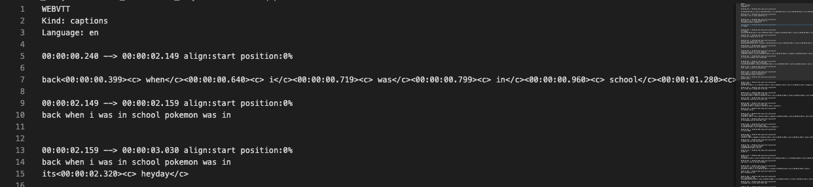
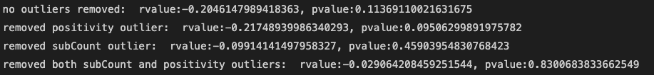
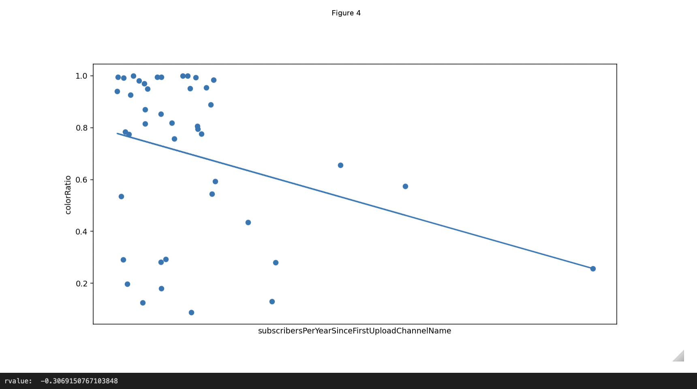

## Semantic and Visual Analysis of 2D commentary/ storytime Youtubers
***
# Introduction
I am subscribed to 35 channels on Youtube and 12 of them are hand-drawn animation commentary youtubers. By '2d animation commentary youtuber', I am referring to youtubers who upload animations with narrations. Some well-known examples of 2d animation commentary channel are Kurzesagt, TheOdd1sOut, and Psych2Go. 
At one point, I attempted producing 2d animation commentary content myself. It was a lot of work with recording audio, drawing, and editing. That made me wonder if there were some traits that attracted more subscribers, and if there were, it might be good to focus on those before trying anything else.
So I decided to put my code-wrangling skills to use and commit to a data-science project. 

# Data Collection
**Terminology**
`userId` = a unique string for every user on youtube
`channelId` = `userId` prepended by `UC`. Unique for every channel on youtube.
`videoId` = a unique string for every video on youtube
`subscriber count` = number of subscribers to a channel

**Method**
I have four sets of data I need for this project.
1. channel information (subscriber count, channel title, channel description, videoCount)
2. video information (video title, video description, publishTime, view count, privacy status, associated `channelId`)
3. caption files (human-preferred over auto-generated)
4. each channel's most viewed video's `videoId`

I got a list of 61 2d commentary/storytime youtubers from various sources including  commentary videos recommended to me by youtube, famousbirthdays.com, and linked channels made public on other youtubers' profiles. 

I collected `channelIds` from the url of each channel.

Using this list of 61 `channelIds`, I called `GET https://www.googleapis.com/youtube/v3/channels` to gather information about the channel including
* channel title
* channel description
* creationDate
* total viewcount
* total subscriberCount (rounded)
* video Count (for data accountability)

Using the list of 61 `channelIds`, I called `GET https://www.googleapis.com/youtube/v3/search` https://developers.google.com/youtube/v3/docs/search/list to gather information about the content on the channel including
* affiliated channels
* videos
    * videoId
    * publish time
    * channelId
    * description
    * thumbnails
    * whether it's a live stream or upcoming, etc.

I gathered all the videoIds from the `searchListResponse` and created a dictionary where each `channelId` was a key for a value which was a list of the channel's `vidId`s. 
Using those `vidId`s, (approximately 5330 of them), I called `GET https://www.googleapis.com/youtube/v3/search` again with the videoIds to get a `videoListResponse` containing
* videoId
* publishedAt (to get the very first upload date of each channel)
* videoTitle
* video description
* duration 
* privacyStatus (for data accountability)
* viewCount
* likeCount
* ~~dislikeCount~~
* commentCount

Each api call was made on the same day to query channel information at the same time. I also the data from the `videoListResponse` to get the all videos associated with a channelId and filtered the video with the highest number of views. 

With the cleaned list of videoIds, I started gathering caption files. Originally, I was going to use 'https://developers.google.com/youtube/v3/docs/captions/download' until I realized not only is each caption-api call worth 200 quota points (which means it'd take me 106 days to get all the caption files), but the call also needs to be made by someone who is a youtube partner which I'm not. So I looked for an alternative, and `youtube-dl` exceeded all my expectations.

I gathered all the caption files with `youtube-dl` and later, the video frames for video analysis.

### Shortcomings:
**Hairy data**
There are videos that are not 2d animation commentary videos in the dataset. These channels often also have music videos, product reviews, vlogs (video blogs), gameplay (game playthroughs), and animation meme (a catchy song + a catchy animation) videos. 
It's not clear how youtube assigns topics/ genres to these videos, but the only one that seemed aptly applied were videos that were labeled as part of the music category.  Animation memes which are not commentary videos, gameplays… I did manage to remove music videos- videos that are completely music by going through the topic_details.
A possible solution is to train a `CNN-RNN` model on gameplay, vlogs, and animation, to classify videos and then remove any that are gameplay or vlogs. To filter out commentary animations with animation would be to detect any spoken human voice in the video. I'm not sure how easy it is in practice but it seems like a feasible approach. 

# Semantic Analysis
I ran a query with `youtube-dl` to get pre-written (by a human) captions and auto-generated if the former does not exist to make sure I had as many caption files as I could. I ended up getting captions for around 84% of the number of videos.
. 
The reason for missing captions was either privated videos or videos without captions- animations or animation memes. 

First, I took just the text in the captions (avoiding timestamps). Then I cleaned the data. Most auto-generated vtt files had three of the same lines for some reason.
. 

So before running Vader on the lines, I created a `set` out of a `list` that contained those lines to get just one occurrence of a line to avoid emphasizing one caption file's contents over another. 

I then used `NLTK.Vader` to run semantic analysis on the captions. Here are some examples:

For each channel, I calculated average of the compound scores and got the general sentiment score of each channel. 
`sum(target_df['compound'])/len(target_df)`

Here is the resulting plot. 

Removing outliers didn't seem to improve the correlation value (rvalue). Removing the , however, brought the p-value down to 0.095 which may support the idea of rejecting the null hypothesis. I also tried getting Spearman's correlation in hopes of getting clearer results than through Pearson's. 

Spearman's also failed to get a monotonic relationship between the two variables. 
Thus, the results are inconclusive.

## Shortcomings
**application of `VADER` on captions**
Part of the `Vader` algorithm works by [applying rules](https://github.com/nltk/nltk/blob/develop/nltk/sentiment/vader.py#L217) to calculate sentiment valence (the magnitude of the polarity). An example is how the capitalization of words is seen as emphasis by VADER and impacts the following adjective. Punctuation also plays a role in sentiment calculations, e.g. an `!` magnifying any sentiment that preceded the punctuation. 
As seen below, how the words are passed into `Vader` matters. 

Given that captions often forego punctuation, especially auto-generated captions which are mostly speech-to-text and do not consider punctuation within scope, there's a lot of missing information with trying to estimate sentiment on caption files. Also, the purpose of captions is to clarify a scene. They're not meant to convey any meaning on their own and work with a visual to communicate something to an audience. It doesn't rely on grammar or syntax to get any information across- which may be why it's not a great use case of `Vader`.

However, since I applied `Vader` to caption files for every single channel, the order in which the channels are positive to negative are probably not too incorrect. 

**Hairy captions**
I gathered caption files, human-generated preferred over auto-generated. Human-generated might be from a volunteer, the youtuber themselves, or a fan being extra. Here's an example of very extra captions:

(...and while securing the images above, I realized this video's captions is also in my data OTL
)
This can impact sentiment score output. 

**Limitations**
The original goal was to analyze each video and track emotions like anger, disgust, fear, happiness, sadness and surprise. The ideal result was for me to feed in a caption file or an mp3 file and get a result like `32.3% anger, 52.3% happiness, 14.5% disgust 0.9% fear`.. something like that. 

There were packages that claimed to do that, but they didn't have any proven track record. One of them actually turned out to be a fork from the `Vader` project with a few labels added on top of words, and I couldn't find any methodology on how the package authors applied these labels. There were other models that could perform this but they were either expensive services or only work on sentences. While there are many accurate ways to chop up a paragraph into sentences using punctuation detection, there aren’t many accurate ways to chop up a wall of text into sentences consumable by these models.

# Frame-by-Frame Analysis
Using `OpenCV`, `youtube-dl` and `ffmpeg`, I got frames (256x256) from the most viewed videos of each channel. Ideally, I would've analyzed all the videos for each channel, but just uploading two videos' worth of frames to a server (kaggle, google drive) was an estimated four hours lol and there is no way I can store the frames of more than 5000 videos on my laptop locally. 

I found out that there were some videos that were animation memes so I removed any instances of videos shorter than 3 minutes and 30 seconds and left the channel out of analysis. 

**Color Ratio**
Most animators draw on a white canvas in black. (There was one who drew on a light-grey canvas that got a colorRatio of 1- but that channel was a false datapoint. The channel had animations, but not commentary) 
There are some youtubers that color a lot, and there are others who color less. Some draw backgrounds, some don’t. 

So to find out if there is a relationship between colorwork in an animation video with subscriber counts, I decided to find out how much of the video is colored. I captured how much of the video was colorized by reading each image as a greyscale image, getting the ratio of non-pure-white (255,255,255), non-pure-black(0,0,0) pixels to the total number of pixels. 

The correlation coefficient between how colored the art was to the average subcount per year had a negative correlation of -.3. (aka, more colors, possibly more subs)

I tried a couple of other things, such as getting how frequently the animation "changes". Some animators use rigging, draw pictures and put them in order (like a powerpoint slide), animate short clips, and animate longer clips. I was wondering if this mattered at all. 
I decided to remove stills by using the measurement of SSIM (structural similarity) which normalizes how different two images are between `0` and `1`. A SSIM value of `1` means they are identical and a SSIM value of `0` means the images are completely different. Below are some examples. 

Given some examples including the one above, I set the 'still frame SSIM' threshold at 0.94 and removed the second frame from any consecutive pair that had a SSIM value that was larger than 0.94. 

And then I divided the number of unique frames by the number of total frames to get the 'validityRatio'. I could've named this better. And then I plotted it on the x-axis with the subCount as subscribers and there was no correlation. 

The r-value is -0.08. 

Given all the information I gathered (mse_mean, mse_std, ssim_mean, ssim_std), I tried getting the correlation values as well. I didn't think I could get an r-value closer to 0 than -0.08, but I did. 

# Shortcomings 
**Using SSIM instead of MSE**
I started out with a high-level idea of identifying scenes and avg scene length through the methodology proposed in this [paper](https://arxiv.org/abs/2003.10685) using MSE values, but the MSE turned out to vary wildly between different videos. 

Applying the same rules to a video with a mean MSE of `60` and a video with mean `2118` didn't seem right. A video with a low mean MSE probably meant there were fewer changes between each frame and a video with a high mean MSE probably meant there were more changes between each frame. (I tried looking for a correlation between avg MSE and rescaled subcounts- the correlation coefficient was infinitesimal)

**Storage**
I think logically, the most-viewed video of a channel can represent the channel pretty well. But the scores would be more holistic if I analyzed more videos. 

**Conclusion**
The amount of animation doesn’t have much to do with subscriber counts, but the coloring seems to. 

# Potential:
I want to try analyzing audio. Audio analysis is completely new for me- I have experience with NLP work from when I was in my undergrad program and experience with CV- at least, video analysis- from that time I was super into animation workflow expediting using deep-learning. I got a little discouraged from the low correlation scores but maybe I can do this some other time on a bigger dataset. 

# If I were to do this again, 
I'd 
1. probably not do this kind of data-analysis on youtubers. The dataset was far more noisy and hard to control than I anticipated. Or I want to try again when I have a better set of tools and a deeper understanding of data science to carry out my analysis. 
2. not jump head-in. The entire process, I'd think of one thing, try it, think of another thing, try that, and then loop back and get confused. I underestimated the importance of organization. The important thing to do is to scope the problem before starting the investigation and have some loose but clear guidelines for what I wanted to do with the dataset.
3. Actually apply good software-engineering practices. I would keep my code organized and easy to run. I didn't think I'd have to add new datapoints or rerun anything- so my code was just a one-shot effort to get something done. It resulted in a lot of complications when I tried to add more datapoints. 

But overall, this was a very fun, insightful side-project. 
