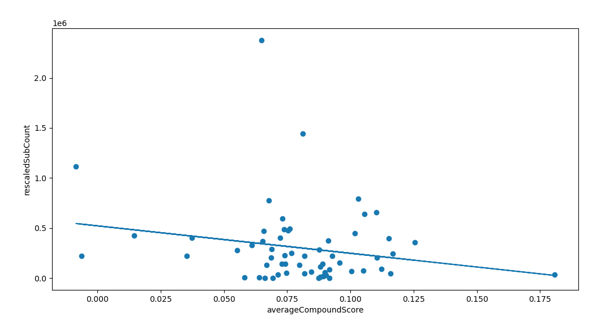

## Semantic and Visual Analysis of 2D commentary/ storytime youtubers
***

# Data Collection
I got a list of 61 2d commentary/storytime youtubers from various sources including  commentary videos recommended to me by youtube, famousbirthdays.com, and linked channels made public on other youtubers' profiles. 

I collected `channelIds` from the url of each channel.

Using this list of 61 `channelIds`, I called `GET https://www.googleapis.com/youtube/v3/channels` to gather information about the channel including
* channel title
* channel description
* creationDate
* total viewcount
* total subscriberCount (rounded)
* videoCount. 

Using the list of 61 `channelIds`, I called `GET https://www.googleapis.com/youtube/v3/search` https://developers.google.com/youtube/v3/docs/search/list to gather information about the content on the channel including
* affiliated channels
* videos
    * videoId
    * publish time
    * channelId
    * description
    * thumbnails
    * whether it's a live stream or upcoming, etc.

I gathered all the videoIds from the `searchListResponse` and created a dictionary where each `channelId` was a key for a value which was a list of the channel's `vidId`s. 
Using those `vidId`s, (approximately 5330 of them), I called `GET https://www.googleapis.com/youtube/v3/search` again with the videoIds to get a `videoListResponse` containing
* videoId
* publishedAt
* videoTitle
* video description
* duration
* definition
* licensed content boolean
* privacyStatus
* publicStats Viewable boolean
* made for kids?
* viewCount,
* likeCount
* ~~dislikeCount~~
* commentCount
* favoriteCount..? 

After viewing the categories of the videos, I found out there were a lot of music videos and speeddrawing videos under the category of 'music'. I removed all of these instances. There may still be some videos with non 2d animation commentary content, but there were limitations to how much I could find out what the video was about with just the information above. 

With the cleaned list of videoIds, I started gathering caption files. Originally, I was going to use 'https://developers.google.com/youtube/v3/docs/captions/download' until I realized the quota for it is 200 and I had about 5330 videos that could have captions for me to download (basically, worst cas, I'd need a total of 1066000/10000=106.6 days to collect just the captions). So I decided to use youtube-dl which is an open-source project with an unlicense license (hallelujah) to download the captions. 

I also processed the data from the `videoListResponse` to get the video with the highest number of views to get the mostViewedVideo and downloaded those videos through `youtube-dl`. 

# Semantic Analysis
I ran a query with `youtube-dl` to get pre-written (by a human) captions and auto-generated if the former does not exist to make sure I had as many caption files as I could. I ended up getting captions for around 84% of the number of videos. 
. 

First, I took just the text in the captions (avoiding timestamps). Then I cleaned the data. Most auto-generated vtt files had three of the same lines for some reason.
. 

So before running Vader on the lines, I created a `set` out of a `list` that contained those lines to get just one occurrence of a line to avoid emphasizing one caption file's contents over another. 

I then used `NLTK.Vader` to run semantic analysis on the captions. Here are some examples:

For each channel, I calculated average of the compound scores and got the general sentiment score of each channel. 
`sum(target_df['compound'])/len(target_df)`

Here is the resulting plot. 

The scatter plot is scattered. 

Removing outliers didn't seem to improve the correlation value. I also tried getting Spearman's correlation because Pearson's was not working. Spearman's also failed to get a monotonic relationship between the two variables. 
. 
The increase of p-values as we remove outliers seems to indicate that there is no relationship between semantics and subscriber counts. 

## Shortcomings
There are some flaws in the methodology above. 

Part of the `Vader` algorithm works by [applying rules](https://github.com/nltk/nltk/blob/develop/nltk/sentiment/vader.py#L217) to calculate sentiment valence (the magnitude of the polarity). An example is how the capitalization of words is seen as emphasis by VADER and impacts the following adjective. Punctuation also plays a role in sentiment calculations, e.g. an `!` magnifying any sentiment that preceded the punctuation. 

As seen below, how the words are passed into `Vader` matters. 

Given that captions often forego punctuation, especially auto-generated captions which are mostly speech-to-text and do not consider punctuation within scope, and that there's a lot of missing information with trying to estimate sentiment on caption files. 

[paper](http://eegilbert.org/papers/icwsm14.vader.hutto.pdf) (VADER: A Parsimonious Rule-based Model for Sentiment Analysis of Social Media Text): 
>In essence, this paper reports on three interrelated efforts: 
>1) the development and validation of a gold standard sentiment lexicon that is sensitive both the polarity and the intensity of sentiments expressed in social media microblogs (but **which is also generally applicable to sentiment analysis in other domains**); 
>2) the identification and subsequent experimental evaluation of generalizable rules regarding **conventional uses of grammatical and syntactical aspects** of text for assessing sentiment intensity; and 
>3) comparing the performance of a parsimonious lexicon and rule-based model against other established and/or typical sentiment analysis baselines

The purpose of captions is to clarify a scene. They're not meant to convey any meaning on their own and work with a visual to communicate something to an audience. It doesn't rely on grammar or syntax to get any information across- which may be why it's not a great use case of `Vader`.

# Frame-by-Frame Analysis
Using `OpenCV`, I got frames (256x256) from the most viewed videos of each channel. Ideally, I would've analyzed all the videos for each channel, but just uploading two videos' worth of frames to google drive estimated four hours lol 

Because the number of the videos was fairly small, I removed any instances of videos shorter than 3 minutes and 30 seconds. 

From that, I captured how much of the video was colorized by reading each image as a greyscale image, getting the ratio of non-pure-white (255,255,255), non-pure-black(0,0,0) pixels to the total number of pixels. 

This was a little better than the semantic output, where the correlation coefficient between how colored the art was to the average subcount per year had a negative correlation of -.3. (aka, more colors, possibly more subs)

I tried a couple of other things, such as getting how frequently the animation "changes". I began by calculating the MSE (mean squared error) between the two consecutive frames and seeing the overall distribution of them over different videos. It turned out to be very very spread out with some 

# Hindsight
Two issues I realized **after** I closed the book on the project. 
1. My dataset is small and skewed. 
Finding correlation in a small dataset is dicey, but it's worse when the dataset is skewed. 
Most of the youtubers in my dataset are verified- they have at least 100k subscribers. They are well-known in the Youtube domain, and I ended up with them because I know them and their names kept popping up in my searches. If I had an equal proportion of 2d animation commentary youtubers with smaller subscriber counts, the results could have been different. 
2. The data extracted from the content is noisy and hard to clean. 
For the semantic analysis, I gathered caption files, human-generated preferred over auto-generated. Human-generated might be from a volunteer, the youtuber themselves, or a fan being very extra. 

The last case poses a lot of issues for people like me trying to analyze sentiment over captions. There's also contextual captions like **[wind rustling]** and **[Music ]** 

For the animation analysis, my focus was on the 2d animation and editing. A lot of the videos have advertisement clips in them (__"This video is sponsored by NordVPN 😊🎶"__). Others have portions of video footage mixed in with the animation. A solution would be to find or build a model that classifies clips as video footage vs. animation, but I already spent a month on thissss... 

Maybe it'll be another fun side-project. 

