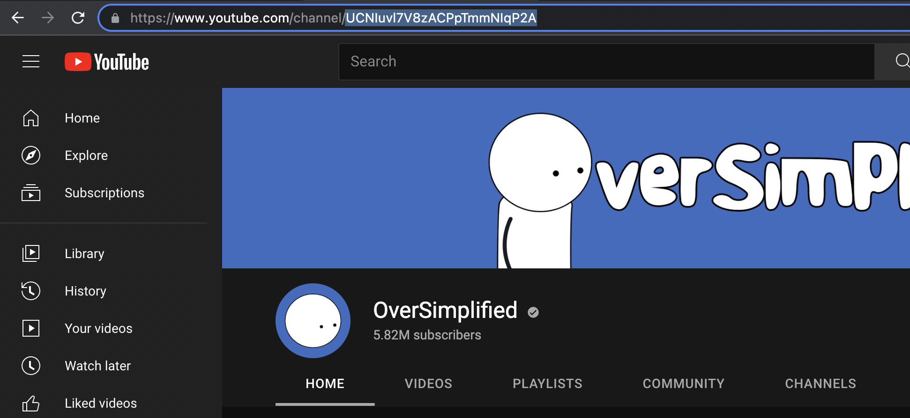
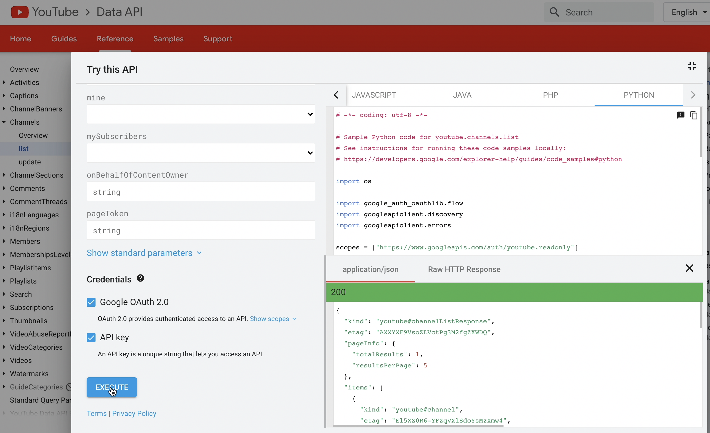
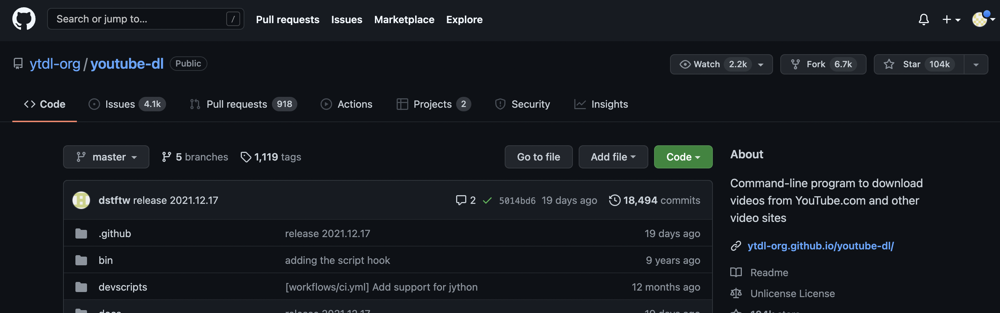

## Semantic and Visual Analysis of 2D commentary/ storytime youtubers
***

# Data Collection
I got a list of 61 2d commentary/storytime youtubers from various sources including  commentary videos recommended to me by youtube, famousbirthdays.com, and linked channels made public on other youtubers' profiles. 

I collected `channelIds` from the url of each channel.

Using this list of 61 `channelIds`, I called `GET https://www.googleapis.com/youtube/v3/channels` to gather information about the channel including
* channel title
* channel description
* creationDate
* total viewcount
* total subscriberCount (rounded)
* videoCount. 

Using the list of 61 `channelIds`, I called `GET https://www.googleapis.com/youtube/v3/search` https://developers.google.com/youtube/v3/docs/search/list to gather information about the content on the channel including
* affiliated channels
* videos
    * videoId
    * publish time
    * channelId
    * description
    * thumbnails
    * whether it's a live stream or upcoming, etc.

I gathered all the videoIds from the `searchListResponse` and created a dictionary where each `channelId` was a key for a value which was a list of the channel's `vidId`s. 
Using those `vidId`s, (approximately 5330 of them), I called `GET https://www.googleapis.com/youtube/v3/search` again with the videoIds to get a `videoListResponse` containing
* videoId
* publishedAt
* videoTitle
* video description
* duration
* definition
* licensed content boolean
* privacyStatus
* publicStats Viewable boolean
* made for kids?
* viewCount,
* likeCount
* ~~dislikeCount~~
* commentCount
* favoriteCount..? 

I was going to use 'https://developers.google.com/youtube/v3/docs/captions/download' until I realized the quota for it is 200 and I had about 5330 videos that could have captions for me to download (basically, worst cas, I'd need a total of 1066000/10000=106.6 days to collect just the captions). So I decided to use youtube-dl which is an open-source project with an unlicense license (hallelujah) to download the captions. 

I also processed the data from the `videoListResponse` to get the video with the highest number of views to get the mostViewedVideo and downloaded those videos through `youtube-dl`. 

# Semantic Analysis
I ran a query with `youtube-dl` to get pre-written (by a human) captions and auto-generated if the former does not exist to make sure I had as many caption files as I could. I ended up getting captions for around 84% of the number of videos. 
. 

First, I took just the text in the captions (avoiding timestamps). Then I cleaned the data. Most auto-generated vtt files had three of the same lines for some reason.
. 

So before running Vader on the lines, I created a `set` out of a `list` that contained those lines to get just one occurrence of a line to avoid emphasizing one caption file's contents over another. 

I then used `NLTK.Vader` to run semantic analysis on the captions. Here are some examples:

For each channel, I calculated average of the compound scores and got the general sentiment score of each channel. 
`sum(target_df['compound'])/len(target_df)`

Here is the resulting plot. 

The scatter plot is scattered. 

Removing outliers didn't seem to improve the correlation value. I also tried getting Spearman's correlation because Pearson's was not working. Spearman's also failed to get a monotonic relationship between the two variables. 
. 
The increase of p-values as we remove outliers seems to indicate that there is no relationship between semantics and subscriber counts. 

# Frame-by-Frame Analysis

